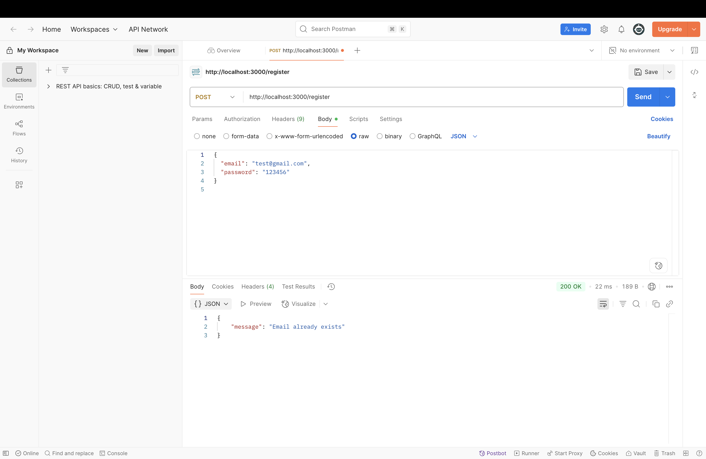
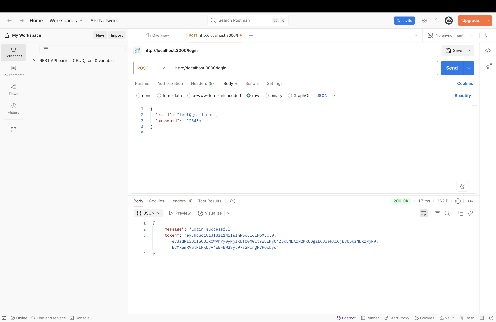

# Authenticated Backend with Hono, TypeScript, Prisma & JWT Reflection

## Main Concepts Applied

In this practical, I implemented a secure REST API using Hono, TypeScript, Prisma, and PostgreSQL. I applied core concepts of **authentication** and **authorization** including:
* User registration and login endpoints implementation
* **JWT token-based authentication** for securing API access
* Password hashing using Bun for secure credential storage
* **Middleware integration** for token verification on protected routes
* **Prisma ORM** for managing user and account data relationships
* Error handling for authentication and authorization failures
* RESTful API design principles with proper HTTP status codes

## What I Learned

I learned how to build secure authentication systems in modern backend applications. I now understand how to:
* Implement user registration and login functionality with proper validation
* Hash passwords securely using Bun's built-in password hashing capabilities
* Generate and verify JWT tokens for stateless authentication
* Use Prisma ORM for database operations and relationship management
* Apply middleware for protecting routes and validating user sessions
* Handle authentication errors gracefully with appropriate HTTP responses
* Structure backend applications with clear separation of concerns

This helped me understand the fundamental difference between authentication (verifying who someone is) and authorization (controlling what they can access), and how these concepts work together to create secure API endpoints.

## Challenges and How I Solved Them

**Challenge 1: Handling Prisma Database Errors**
* **Problem:** I encountered issues when users tried to register with existing email addresses, causing the application to crash with unhandled Prisma errors
* **Solution:** I solved this by implementing proper error handling using `PrismaClientKnownRequestError` to catch specific error codes and return user-friendly error messages to the client

**Challenge 2: JWT Token Management**
* **Problem:** I had difficulty correctly signing and verifying JWT tokens, especially understanding the proper middleware implementation for protected routes
* **Solution:** I solved this by carefully studying Hono's documentation and implementing the `sign` and `jwt` middleware correctly, ensuring proper token generation and validation

## Conclusion

This practical gave me a comprehensive introduction to building secure backend APIs with modern tools. Key achievements include:
* Understanding how to implement robust authentication and authorization systems
* Learning to work with JWT tokens for stateless session management
* Gaining experience with Prisma ORM for database operations and data modeling
* Building confidence in error handling and API security best practices
* Understanding the importance of secure credential storage and token-based authentication

Overall, this practical enhanced my backend development skills and provided valuable experience with Hono, TypeScript, and Prisma. I now feel confident implementing authentication and authorization in real-world backend applications and understand the security considerations necessary for protecting user data and API endpoints.